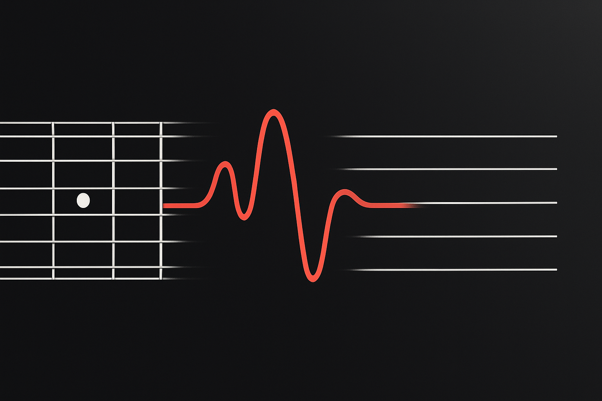

<p align="center">
  
</p>

# MP3 to Guitar Tab Converter

A web application that converts MP3 audio recordings into guitar tablature notation. Perfect for documenting your riffs, learning songs by ear, or sharing your musical ideas.

## Features

- **Audio-to-Tab Conversion**: Convert guitar recordings to easy-to-read tabs
- **MIDI Output**: Download MIDI files for further editing in DAWs
- **Interactive Interface**: Simple, intuitive web UI with dark/light mode
- **Responsive Design**: Works on desktop and mobile devices

## Tech Stack

- **Frontend**: Streamlit web application
- **Audio Processing**: Basic Pitch (by Spotify) for audio-to-MIDI conversion
- **Tab Generation**: Tayuya for MIDI-to-tablature rendering

## Project Structure

```
tab-gener8or/
├── app.py                  # Main Streamlit application
├── main.py                 # Command-line interface version
├── requirements.txt        # Project dependencies
├── assets/                 # Static assets
│   └── images/             # Image files for UI
├── utils/                  # Utility scripts
│   ├── check_midi.py       # MIDI file inspection tool
│   └── render_tab.py       # Tab rendering utility
└── tests/                  # Test files (if any)
```

## Installation

1. **Clone the repository:**
   ```bash
   git clone https://github.com/yourusername/tab-gener8or.git
   cd tab-gener8or
   ```

2. **Create a virtual environment:**
   ```bash
   python -m venv venv
   source venv/bin/activate  # On Windows: venv\Scripts\activate
   ```

3. **Install dependencies:**
   ```bash
   pip install -r requirements.txt
   ```

## Usage

### Web Interface

1. **Start the Streamlit app:**
   ```bash
   streamlit run app.py
   ```

2. **Access the app** in your browser at `http://localhost:8501`

3. **Use the app:**
   - Upload an MP3 file containing guitar recording
   - Click "Convert to Guitar Tab"
   - View and download the generated tablature and MIDI file

### Command Line Interface

For batch processing or scripting:

```bash
python main.py your_audio_file.mp3
```

## Best Practices for Good Results

- Use **clean recordings** with minimal background noise
- Record **single-instrument tracks** (guitar only works best)
- Ensure **well-defined notes** with adequate spacing
- For complex pieces, try **slower tempos** first

## Deployment

### Deploy to Streamlit Cloud

1. Push your code to GitHub
2. Go to [Streamlit Cloud](https://streamlit.io/cloud)
3. Connect your GitHub repository
4. Configure as needed and deploy

### Deploy with Docker

A Dockerfile is provided for containerized deployment:

```bash
# Build the Docker image
docker build -t tab-gener8or .

# Run the container
docker run -p 8501:8501 tab-gener8or
```

## Contributing

Contributions are welcome! Please feel free to submit a Pull Request.

## License

This project is licensed under the MIT License - see the LICENSE file for details.

## Acknowledgements

- [Basic Pitch](https://github.com/spotify/basic-pitch) by Spotify
- [Tayuya](https://github.com/jcbhmr/tayuya) MIDI to guitar tab converter
- [Streamlit](https://streamlit.io) for the web framework 